# Architecture

`auth-platform` is a multi-module Maven project. Only `auth-service` has real code so
far; `common`, `user-service`, `notification`, and `gateway` are module skeletons
reserved for future work (see [decisions.md](decisions.md#decision-6-multi-module-maven-layout-from-day-one)).

## Logical domain view

This is the conceptual shape of the platform — how its *capabilities* group by
responsibility, independent of how the Java code is physically packaged today:

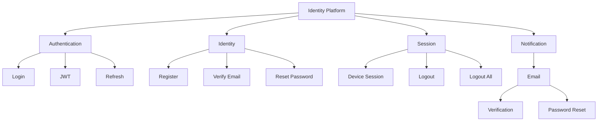

**This is a logical view, not the physical package structure.** The actual Java
code stays organized by technical layer (`controller/`, `service/`, `repository/`,
etc. — see the component diagram below), not by these domain folders. Repackaging
a 40+ file codebase into `auth/identity/session/notification/` purely for
organizational purposes, mid-feature, was judged not worth the churn each time this
came up (JWT day, the identity-module day, and again here) — but the logical
grouping above is real and worth documenting on its own, since it's how the
*capabilities* actually relate to each other regardless of which folder each class
lives in.

## Component diagram

```mermaid
flowchart TB
    Client(["Client (curl / Postman / Swagger UI)"])

    subgraph AuthService["auth-service"]
        direction TB
        SecurityFilterChain["Spring Security filter chain<br/>(JwtAuthenticationFilter)"]

        subgraph Controllers["controller/"]
            RegCtrl[RegistrationController]
            LoginCtrl[LoginController]
            RefreshCtrl[RefreshTokenController]
            LogoutCtrl[LogoutController]
            SessionCtrl[SessionController]
            VerifyCtrl[EmailVerificationController]
            ResetCtrl[PasswordResetController]
            UserCtrl[UserController]
        end

        subgraph Services["service/"]
            RegSvc[RegistrationService]
            AuthSvc[AuthenticationService]
            RefreshSvc[RefreshTokenService]
            SessionSvc[SessionService]
            VerifySvc[EmailVerificationService]
            ResetSvc[PasswordResetService]
            MailSvc[EmailService]
            UserSvc[UserService]
        end

        subgraph SecurityPkg["security/"]
            JwtSvc[JwtService]
            PwEncoder[PasswordEncoder - BCrypt]
            TokenGen[OpaqueTokenGenerator]
        end

        Repo[UserRepository]
        RefreshRepo[RefreshTokenRepository]
        SessionRepo[SessionRepository]
        VerifyRepo[VerificationTokenRepository]
        ResetRepo[PasswordResetTokenRepository]
        GEH[GlobalExceptionHandler]
    end

    DB[("PostgreSQL<br/>auth_platform.users /<br/>refresh_tokens / sessions /<br/>verification_tokens / password_reset_tokens")]

    Client --> SecurityFilterChain
    SecurityFilterChain --> RegCtrl
    SecurityFilterChain --> LoginCtrl
    SecurityFilterChain --> RefreshCtrl
    SecurityFilterChain --> LogoutCtrl
    SecurityFilterChain --> SessionCtrl
    SecurityFilterChain --> VerifyCtrl
    SecurityFilterChain --> ResetCtrl
    SecurityFilterChain --> UserCtrl

    RegCtrl --> RegSvc
    LoginCtrl --> AuthSvc
    RefreshCtrl --> RefreshSvc
    LogoutCtrl --> RefreshSvc
    LogoutCtrl --> Repo
    SessionCtrl --> SessionSvc
    SessionCtrl --> Repo
    VerifyCtrl --> VerifySvc
    ResetCtrl --> ResetSvc
    UserCtrl --> UserSvc

    RegSvc --> PwEncoder
    RegSvc --> Repo
    RegSvc --> VerifySvc
    RegSvc --> MailSvc
    AuthSvc --> PwEncoder
    AuthSvc --> JwtSvc
    AuthSvc --> Repo
    AuthSvc --> RefreshSvc
    RefreshSvc --> JwtSvc
    RefreshSvc --> Repo
    RefreshSvc --> RefreshRepo
    RefreshSvc --> SessionSvc
    RefreshSvc --> TokenGen
    SessionSvc --> SessionRepo
    VerifySvc --> Repo
    VerifySvc --> VerifyRepo
    VerifySvc --> MailSvc
    VerifySvc --> TokenGen
    ResetSvc --> Repo
    ResetSvc --> ResetRepo
    ResetSvc --> PwEncoder
    ResetSvc --> MailSvc
    ResetSvc --> TokenGen
    ResetSvc --> RefreshSvc
    UserSvc --> Repo

    SecurityFilterChain -.uses.-> JwtSvc
    SecurityFilterChain -.uses.-> SessionSvc
    Repo --> DB
    RefreshRepo --> DB
    SessionRepo --> DB
    VerifyRepo --> DB
    ResetRepo --> DB

    RegCtrl -.exceptions.-> GEH
    LoginCtrl -.exceptions.-> GEH
    RefreshCtrl -.exceptions.-> GEH
    LogoutCtrl -.exceptions.-> GEH
    SessionCtrl -.exceptions.-> GEH
    VerifyCtrl -.exceptions.-> GEH
    ResetCtrl -.exceptions.-> GEH
    UserCtrl -.exceptions.-> GEH
```

Note the one-way arrow `RefreshSvc --> SessionSvc`, not the reverse — `SessionService`
never depends on `RefreshTokenService`. That's deliberate; see
[decisions.md](decisions.md#decision-13-one-service-owns-both-refreshtoken-and-session-to-avoid-a-circular-dependency)
for why the two would otherwise form a circular bean dependency. Note also
`SecurityFilterChain -.uses.-> SessionSvc` — every authenticated request now checks
session state directly from the filter chain, before a request ever reaches a
controller; see
[decisions.md](decisions.md#decision-15-check-session-revocation-on-every-request-not-just-token-expiry).

`OpaqueTokenGenerator` is shared by `RefreshTokenService`, `EmailVerificationService`,
and now `PasswordResetService` — all three needed the identical "cryptographically
random, URL-safe string" logic, so it was extracted rather than duplicated. It also
now carries a `hash()` method used only by `PasswordResetService` — see
[decisions.md](decisions.md#decision-22-the-raw-reset-token-is-never-stored-only-its-hash)
for why password reset tokens are hashed before storage while the other two token
types aren't.

`PasswordResetService --> RefreshSvc` is another intentional cross-service call,
alongside the `RefreshSvc --> SessionSvc` one above: completing a password reset
calls `RefreshTokenService.logoutAll()` to revoke every session, the same mechanism
`POST /api/v1/auth/logout-all` uses. See
[decisions.md](decisions.md#decision-23-resetting-a-password-revokes-every-existing-session).

**Why three services instead of one `UserService`:** registration, authentication, and
profile lookup are different responsibilities with different reasons to change —
splitting them keeps each class focused and testable in isolation. See
[decisions.md](decisions.md#decision-7-split-registration-authentication-and-profile-lookup-into-separate-services).

## Account lifecycle — registration through activation

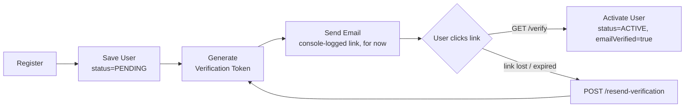

A user created by registration cannot log in (`403`, see
[decisions.md](decisions.md#decision-16-require-email-verification-before-an-account-can-log-in))
until they complete the right-hand path.

## Request flow — registration

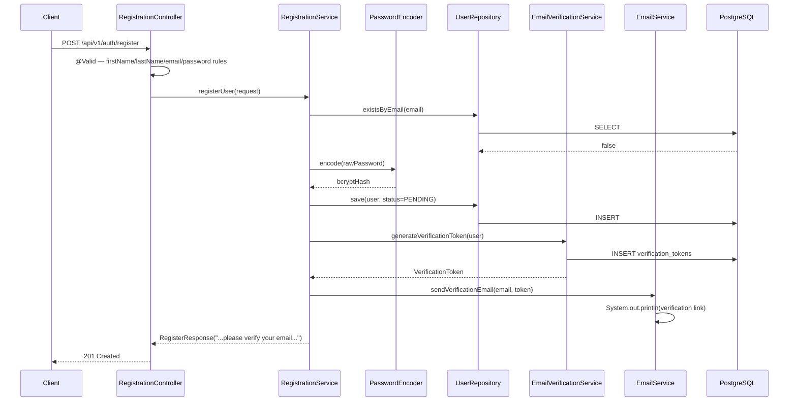

## Request flow — email verification

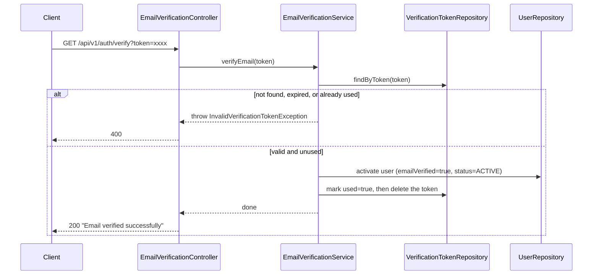

See [decisions.md](decisions.md#decision-19-one-time-tokens-delete-on-use-not-just-a-used-flag)
for why the token is both flagged used *and* deleted, rather than just one or the
other.

`POST /api/v1/auth/resend-verification` follows the same enumeration-safe pattern as
login (Decision 3): it always returns the same generic message, whether the email
doesn't exist, is already verified, or genuinely gets a new token sent — the
internal branching happens in `EmailVerificationService.resendVerification()`, but
nothing about the outward response reveals which case occurred.

## Account lifecycle — forgot password through reset

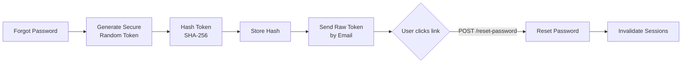

The raw token exists only twice: once when generated, once inside the outbound
email. Only its hash ever touches the database — see
[decisions.md](decisions.md#decision-22-the-raw-reset-token-is-never-stored-only-its-hash).
`H` — invalidating sessions — is not optional cleanup; it's the step that actually
makes the reset meaningful if the account was compromised. See
[decisions.md](decisions.md#decision-23-resetting-a-password-revokes-every-existing-session).

## Request flow — forgot password and reset password

```mermaid
sequenceDiagram
    participant C as Client
    participant Ctrl as PasswordResetController
    participant Svc as PasswordResetService
    participant Repo as UserRepository
    participant RRepo as PasswordResetTokenRepository
    participant Gen as OpaqueTokenGenerator
    participant Mail as EmailService
    participant Enc as PasswordEncoder
    participant RSvc as RefreshTokenService

    rect rgb(40,40,40)
    note over C,Mail: POST /api/v1/auth/forgot-password — public, always the same response
    C->>Ctrl: POST /forgot-password {email}
    Ctrl->>Svc: requestPasswordReset(email)
    Svc->>Repo: findByEmail(email)
    alt not found
        Svc-->>Ctrl: silent no-op
    else found
        Svc->>RRepo: invalidateTokensByUserId(userId)
        Svc->>Gen: generate() then hash(rawToken)
        Svc->>RRepo: save(userId, tokenHash, expiresAt=+1h)
        Svc->>Mail: sendPasswordResetEmail(email, rawToken)
        Mail->>Mail: System.out.println(reset link)
    end
    Ctrl-->>C: 200 "If an account exists, a password reset link has been sent."
    end

    rect rgb(40,40,40)
    note over C,RSvc: POST /api/v1/auth/reset-password — public
    C->>Ctrl: POST /reset-password {token, newPassword}
    Ctrl->>Svc: resetPassword(token, newPassword)
    Svc->>Gen: hash(token)
    Svc->>RRepo: findByTokenHash(hash)
    alt not found, used, or expired
        Svc-->>Ctrl: throw InvalidPasswordResetTokenException
        Ctrl-->>C: 400
    else valid
        Svc->>Enc: encode(newPassword)
        Svc->>Repo: save user with new password hash
        Svc->>RRepo: mark used=true, usedAt=now (row kept, not deleted)
        Svc->>RSvc: logoutAll(userId)
        RSvc->>RSvc: revoke every RefreshToken + Session for userId
        Svc-->>Ctrl: done
        Ctrl-->>C: 200 "Password reset successful. Please log in again."
    end
    end
```

Both endpoints are public — a user requesting a reset has, by definition, no valid
session to authenticate with. See
[decisions.md](decisions.md#decision-24-user-enumeration-prevention-as-one-consistent-pattern-not-four-separate-ones)
for why `forgot-password`'s response never reveals whether the email was registered.

## Request flow — login

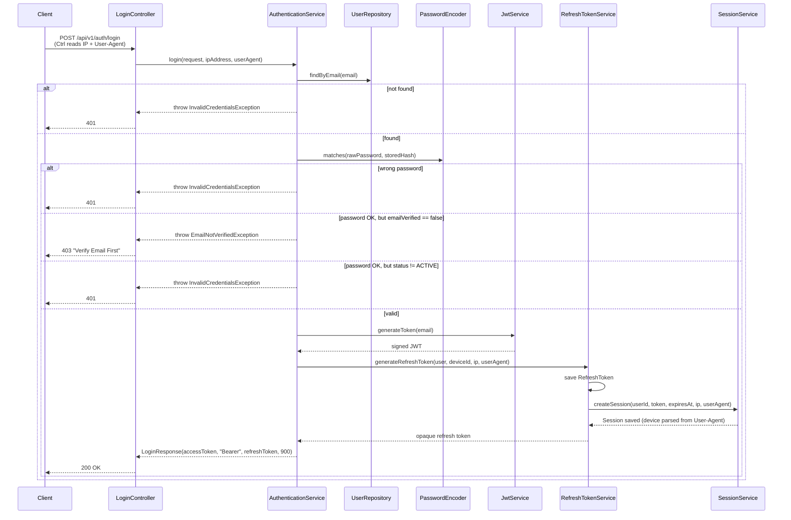

The wrong-password and inactive-status branches both throw the *same*
`InvalidCredentialsException` with the *same* message — see
[decisions.md](decisions.md#decision-3-one-generic-error-for-every-login-failure).
The email-not-verified branch is the **one deliberate exception** to that rule: it
throws a distinct `EmailNotVerifiedException` with a specific, actionable message.
This does technically confirm the email is registered (a minor enumeration signal
Decision 3 was designed to avoid) — accepted because "go check your email" is
near-universal, low-risk UX across real-world auth systems, and the alternative
(a confused user with no idea why login just silently fails) is worse. See
[decisions.md](decisions.md#decision-16-require-email-verification-before-an-account-can-log-in).

## Request flow — refresh token rotation

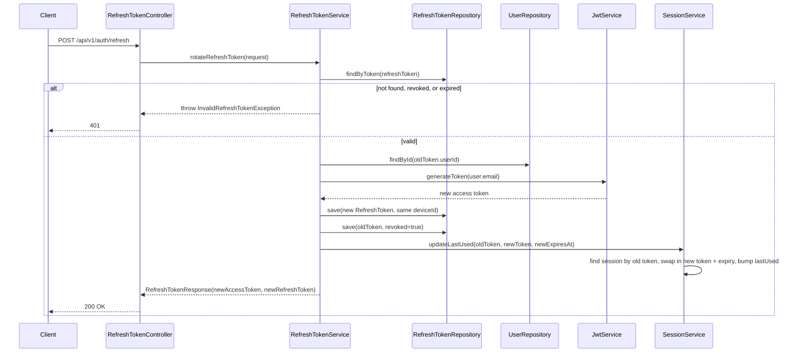

The old refresh token is never deleted, only flagged `revoked = true` — reusing it
after rotation fails the same way an unknown token would. See
[decisions.md](decisions.md#decision-11-rotate-and-revoke-on-every-refresh-never-reuse-a-refresh-token).
Note the session row is *updated in place*, not duplicated — one row per device
persists across every rotation until logout.

## Request flow — logout and logout-all

```mermaid
sequenceDiagram
    participant C as Client
    participant LCtrl as LogoutController
    participant RSvc as RefreshTokenService
    participant SSvc as SessionService

    rect rgb(40,40,40)
    note over C,SSvc: POST /api/v1/auth/logout — public, refresh token proves intent
    C->>LCtrl: POST /logout {refreshToken}
    LCtrl->>RSvc: logout(refreshToken)
    RSvc->>RSvc: validateRefreshToken() then revoke it
    RSvc->>SSvc: deleteByRefreshToken(refreshToken)
    RSvc-->>LCtrl: done
    LCtrl-->>C: 204 No Content
    end

    rect rgb(40,40,40)
    note over C,SSvc: POST /api/v1/auth/logout-all — requires a valid JWT
    C->>LCtrl: POST /logout-all<br/>Authorization: Bearer <token>
    LCtrl->>RSvc: logoutAll(userId from JWT)
    RSvc->>RSvc: revoke every RefreshToken for userId
    RSvc->>SSvc: revokeAndDeleteAllForUser(userId)
    RSvc-->>LCtrl: done
    LCtrl-->>C: 204 No Content
    end
```

See [decisions.md](decisions.md#decision-14-logout-is-public-logout-all-requires-a-valid-access-token)
for why these two have different access rules.

## Security flow — JWT on a protected request

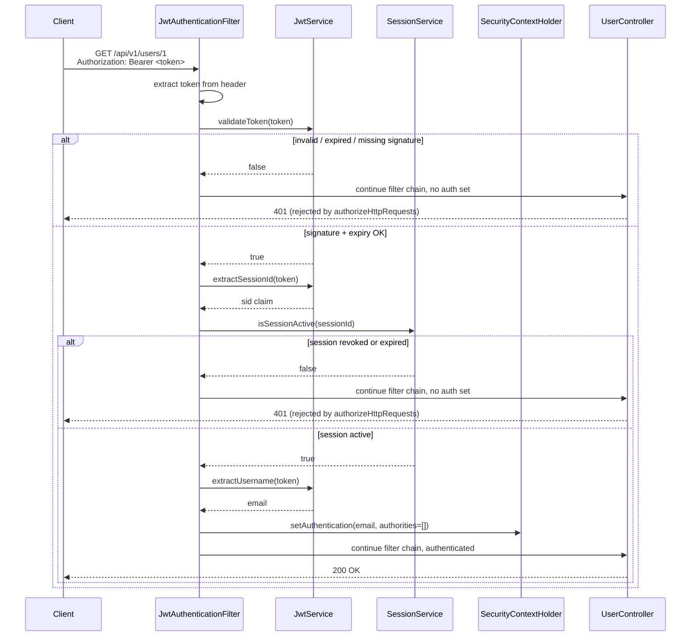

This is the mechanism behind Decision 15 — a token can pass signature and expiry
checks perfectly and *still* get rejected if its session was revoked (logout,
logout-all) since it was issued. It's why every authenticated request now costs one
extra Postgres query before reaching a controller.

**Route rules** (`SecurityConfig`):

| Route | Rule |
|---|---|
| `POST /api/v1/auth/register` | public |
| `POST /api/v1/auth/login` | public |
| `POST /api/v1/auth/refresh` | public (the caller has no valid access token by definition) |
| `POST /api/v1/auth/logout` | public (a valid refresh token is sufficient proof of intent) |
| `POST /api/v1/auth/logout-all` | requires a valid JWT — see [decisions.md](decisions.md#decision-14-logout-is-public-logout-all-requires-a-valid-access-token) |
| `GET /api/v1/auth/verify` | public (the caller isn't logged in yet by definition) |
| `POST /api/v1/auth/resend-verification` | public |
| `POST /api/v1/auth/forgot-password` | public |
| `POST /api/v1/auth/reset-password` | public |
| `GET /api/v1/sessions` | requires a valid JWT |
| `/swagger-ui/**`, `/v3/api-docs/**` | public (dev tooling only) |
| everything else | requires a valid JWT |

Session creation policy is `STATELESS` — no server-side session is ever created; the
JWT is the only proof of identity on each request. See
[decisions.md](decisions.md#decision-4-stateless-authentication).
