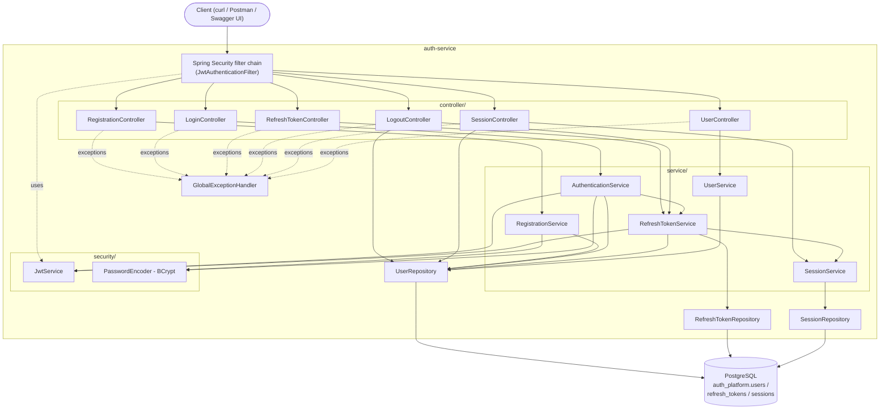
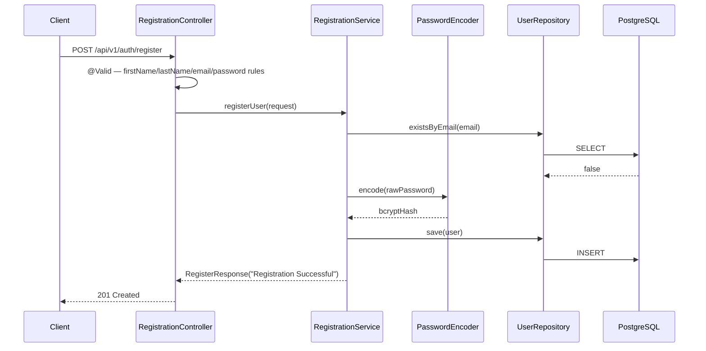
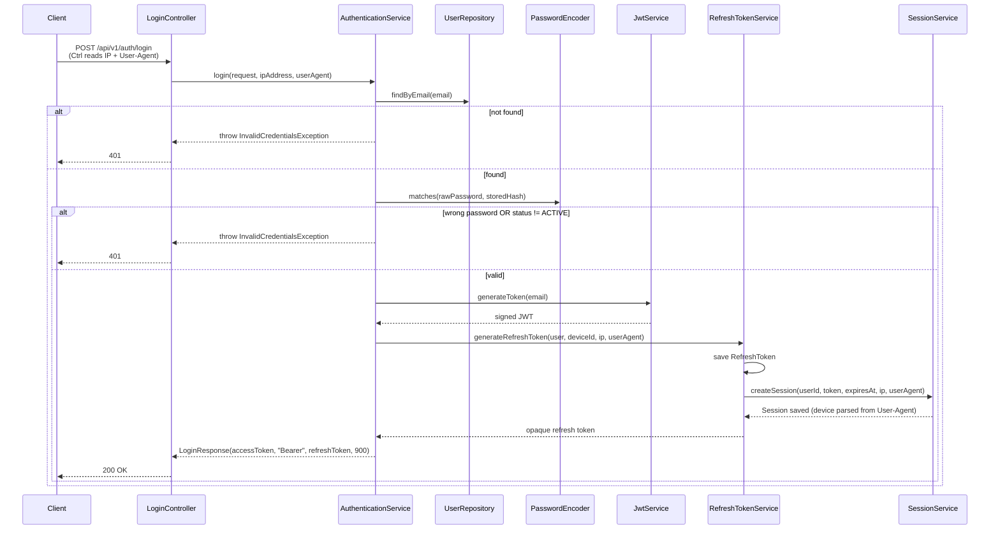
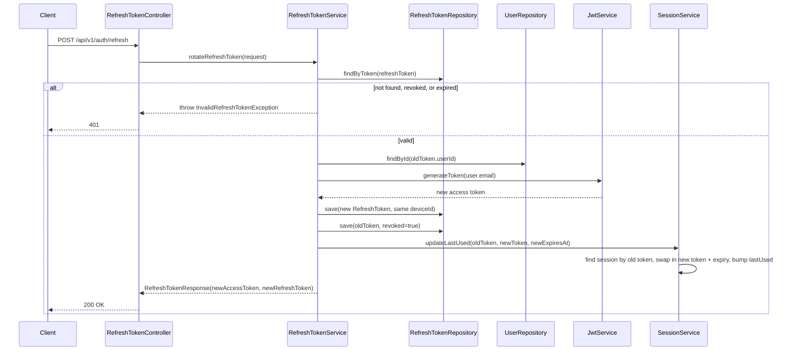
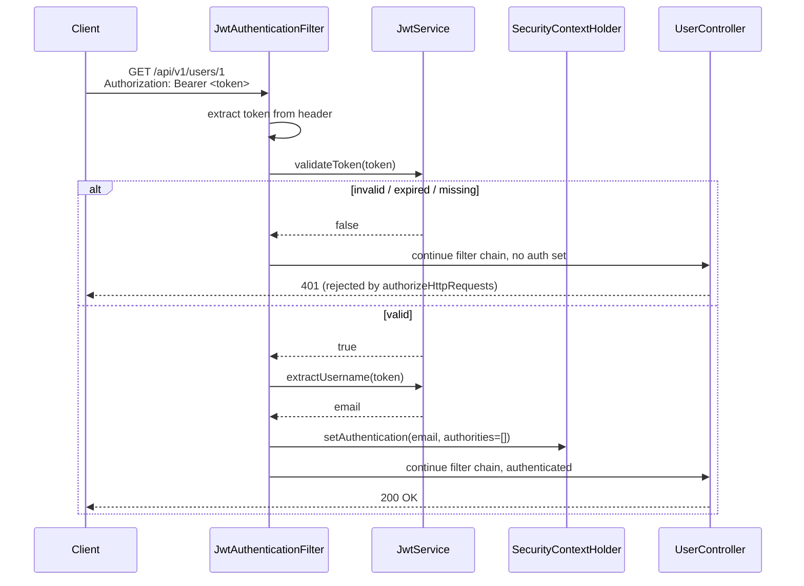

# Architecture

`auth-platform` is a multi-module Maven project. Only `auth-service` has real code so
far; `common`, `user-service`, `notification`, and `gateway` are module skeletons
reserved for future work (see [decisions.md](decisions.md#decision-6-multi-module-maven-layout-from-day-one)).

## Component diagram

Note the one-way arrow `RefreshSvc --> SessionSvc`, not the reverse — `SessionService`
never depends on `RefreshTokenService`. That's deliberate; see
[decisions.md](decisions.md#decision-13-one-service-owns-both-refreshtoken-and-session-to-avoid-a-circular-dependency)
for why the two would otherwise form a circular bean dependency.

**Why three services instead of one `UserService`:** registration, authentication, and
profile lookup are different responsibilities with different reasons to change —
splitting them keeps each class focused and testable in isolation. See
[decisions.md](decisions.md#decision-7-split-registration-authentication-and-profile-lookup-into-separate-services).

## Request flow — registration

## Request flow — login

Every failure branch above throws the *same* `InvalidCredentialsException` with the
*same* message — see
[decisions.md](decisions.md#decision-3-one-generic-error-for-every-login-failure).

## Request flow — refresh token rotation

The old refresh token is never deleted, only flagged `revoked = true` — reusing it
after rotation fails the same way an unknown token would. See
[decisions.md](decisions.md#decision-11-rotate-and-revoke-on-every-refresh-never-reuse-a-refresh-token).
Note the session row is *updated in place*, not duplicated — one row per device
persists across every rotation until logout.

## Request flow — logout and logout-all

```mermaid
sequenceDiagram
    participant C as Client
    participant LCtrl as LogoutController
    participant RSvc as RefreshTokenService
    participant SSvc as SessionService

    rect rgb(40,40,40)
    note over C,SSvc: POST /api/v1/auth/logout — public, refresh token proves intent
    C->>LCtrl: POST /logout {refreshToken}
    LCtrl->>RSvc: logout(refreshToken)
    RSvc->>RSvc: validateRefreshToken() then revoke it
    RSvc->>SSvc: deleteByRefreshToken(refreshToken)
    RSvc-->>LCtrl: done
    LCtrl-->>C: 204 No Content
    end

    rect rgb(40,40,40)
    note over C,SSvc: POST /api/v1/auth/logout-all — requires a valid JWT
    C->>LCtrl: POST /logout-all<br/>Authorization: Bearer <token>
    LCtrl->>RSvc: logoutAll(userId from JWT)
    RSvc->>RSvc: revoke every RefreshToken for userId
    RSvc->>SSvc: revokeAndDeleteAllForUser(userId)
    RSvc-->>LCtrl: done
    LCtrl-->>C: 204 No Content
    end
```

See [decisions.md](decisions.md#decision-14-logout-is-public-logout-all-requires-a-valid-access-token)
for why these two have different access rules.

## Security flow — JWT on a protected request

**Route rules** (`SecurityConfig`):

| Route | Rule |
|---|---|
| `POST /api/v1/auth/register` | public |
| `POST /api/v1/auth/login` | public |
| `POST /api/v1/auth/refresh` | public (the caller has no valid access token by definition) |
| `POST /api/v1/auth/logout` | public (a valid refresh token is sufficient proof of intent) |
| `POST /api/v1/auth/logout-all` | requires a valid JWT — see [decisions.md](decisions.md#decision-14-logout-is-public-logout-all-requires-a-valid-access-token) |
| `GET /api/v1/sessions` | requires a valid JWT |
| `/swagger-ui/**`, `/v3/api-docs/**` | public (dev tooling only) |
| everything else | requires a valid JWT |

Session creation policy is `STATELESS` — no server-side session is ever created; the
JWT is the only proof of identity on each request. See
[decisions.md](decisions.md#decision-4-stateless-authentication).
